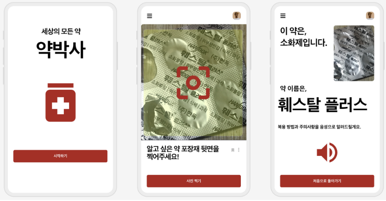
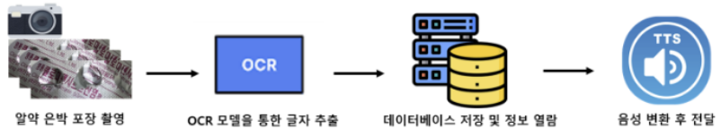
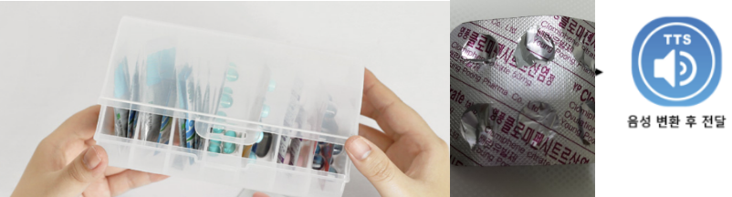

# [2023 대구를 빛내는 SW 해커톤] 

![Header] (http://capsule-render.vercel.app/api?type=rect&color=auto&height=200&section=header&text=Team%20Dr.%20Yak&fontSize=80&animation=twinkling)

## 1. 주제
- 약박사: AI 기반 노년층 대상 Drug Assistant

## 2. 핵심 내용
- __핵심 내용__

    - _**노년층**이 **약의 종류와 복용 방법** 등에 대한 정보를 쉽게 이해하고 접근할_ 수 있도록 도와줌

    - __OCR(Optical Character Recognition)__ 모델과 __TTS(Text-To-Speak)__ 를 활용해 사용자는 약의 사진을 _카메라로 찍어 입력하고_, 해당 약에 대한 이름과 복용 방법에 대한 상세 정보를 획득 할 수 있음

    - __기술 스택__

            

    - 예상 UI Prototype

        

***

- 기술 구현 및 기능 프로세스 설명

    ### __Framework__

    

    ### __Process__

    1. 촬영된 사진을 OCR 인공지능 기술을 통해 뒷면의 모든 텍스트 인식

    2. 인식된 텍스트 뭉치에서 Google Bard 자연어처리 모델을 이용해 약제 이름 추출

    3. 약제 정보 데이터베이스에서 추출된 텍스트와 유사도가 높은 약제 검색

    4. 데이터베이스에 있는 약의 이름, 복용 방법, 주의 사항을 TTS 기술을 통해 음성으로 안내

    5. 수집된 이미지로 구축한 데이터셋을 통해 알약에 대한 분류기(Deep Learning based - Classification model) 학습

## 3. 제안 배경
1. **노령화 사회의 현실**

    - 한국의 노령화: 2022년 기준 65세 이상 고령자 비율이 16% 이상

    - 전 세계적인 노령화 추세: 2050년까지 65세 이상 인구가 2배 이상 증가 예상

2. **노년층의 의약품 복용률**

    - 노년층은 평균적으로 만성 질환 등으로 인해 여러 종류의 약을 먹는 경우가 많고, 이에 따라 약간의 혼동이나 잘못된 복용이 발생하기 쉬움

3. **노년층의 의약품 인식 문제점**

    - 의약품 포장의 _작은 글씨로 인한 정보 인식_ 어려움

    - 또한, 노년층은 _디지털 정보에 접근하는 데 있어 장벽을 느낄 수_ 있어서 약에 대한 올바른 정보를 얻기 어려울 수 있음

4. **알약 보관 방식**

    - 주로 알약을 보관할 때 약에 대한 상세 정보를 포함하는 상자를 제외하고 은박 알약 포장 형태의 상태로 보관함

    - 해당 보관함에 담은 상태로 알약이 어떤 기능을 위한 것인지 헷갈리는 상황이 생김

    ### 보관 방식의 예시
    

    